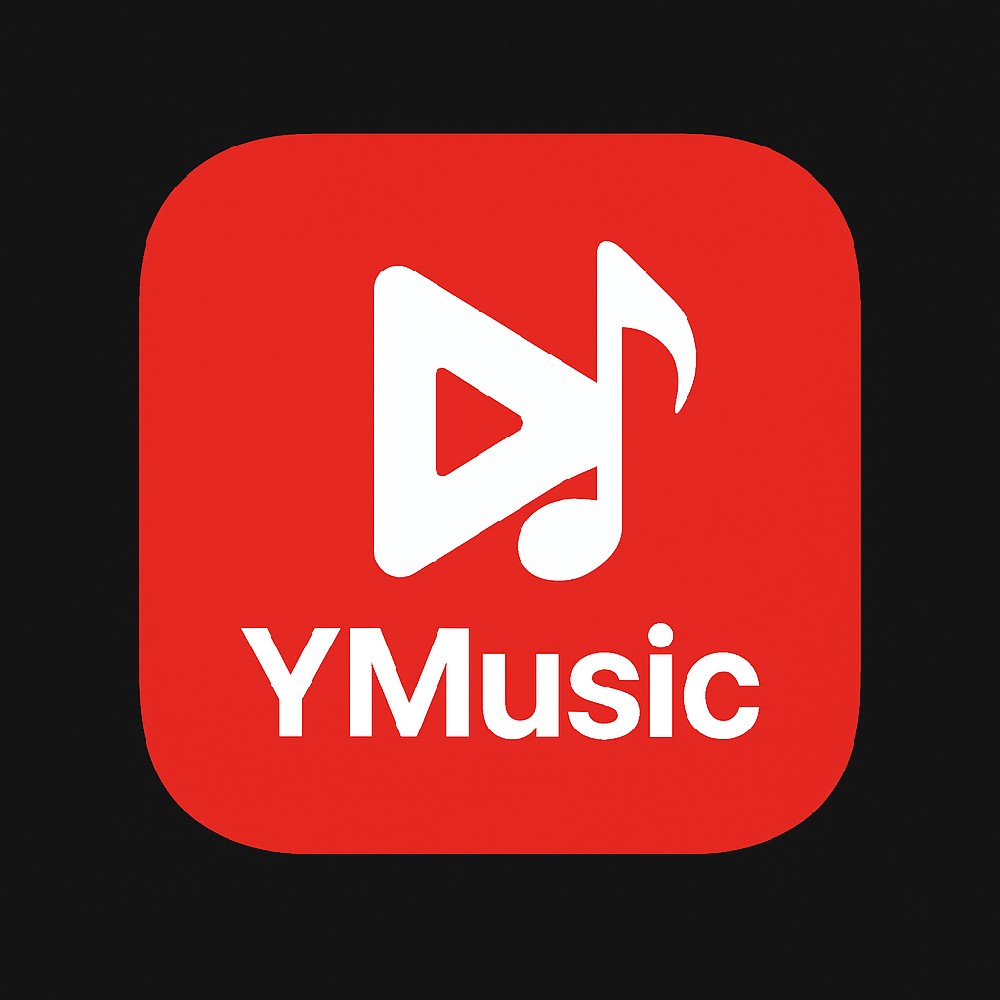

  

# 🎵 YMusic - Your Ultimate YouTube Music Companion

Elevate your listening experience with **YMusic**, a premium, open-source music streaming application. Built with modern Jetpack Compose and powered by the robust NewPipe Extractor, YMusic brings the vast world of YouTube Music directly to your fingertips—minus the interruptions.

## 🌟 Why YMusic?

In a world full of noise, YMusic focuses on what matters most: **the music**. We've crafted an interface that's not just functional, but beautiful, ensuring that your journey through your favorite tracks is as smooth as the audio itself.

### 🎧 Pure Auditory Bliss
- **Lossless-Prioritized Streaming**: Experience crystal-clear audio with smart selection (Opus > M4A > MP3).
- **Uninterrupted Background Play**: Keep the rhythm going even while multitasking or with your screen off.
- **Micro-Second Buffering**: Our advanced 60-second caching ensures your music never skips a beat.
- **Visual Harmony**: Real-time audio visualizers that dance to your music's frequency.

### 🚀 Performance That Sings
- **Liquid-Smooth Scrolling**: Fully optimized for 120Hz displays, making browsing your library a joy.
- **Dynamic Material You**: A UI that adapts its colors to the soul of the album art you're currently playing.
- **Lightweight & Fast**: Designed to be easy on your battery and memory without sacrificing power.

### 🔍 Discover Your Next Obsession
- **Intelligence at its Core**: Smart recommendations that learn your taste over time.
- **Mood-Sync Playlists**: From high-energy "Workout" beats to late-night "Chill" vibes.
- **Instant Search**: Find any track, album, or artist instantly with live suggestions.

### 💾 Your Music, Anywhere
- **Seamless Downloads**: Take your entire library offline with high-quality background downloads.
- **Hybrid Playback**: Effortlessly switch between streaming and local files without missing a note.

## 📱 Supported Features

- ✅ YouTube Music search and streaming
- ✅ Background playback with notification controls
- ✅ Download songs for offline listening
- ✅ Floating player (bubble) support (on beta)
- ✅ Smart recommendations and related songs
- ✅ Mood-based content categories
- ✅ High refresh rate display optimization (on beta)
- ✅ Light/Dark/System theme modes (on beta)
- ✅ Audio visualizer during playback
- ✅ Comprehensive playback controls (play/pause/skip)
- ✅ Progress tracking and resume functionality
- ✅ Local file playback for downloaded content
- ✅ **Universal Lyrics Engine**: Intelligent multi-source lyrics fetching with manual search fallback.
- ✅ **Lyrics Persistence**: Saves and restores preferred lyrics for every song.
- ✅ **Smart Queue Management**: Functional "Up Next" queue with shuffle/repeat.
- ✅ **Quick Skip**: 10-second forward/backward controls.
- ✅ **Premium UI**: Enhanced visibility for light themes and glassmorphism-inspired elements.

## 🔧 Prerequisites

- Android 7.0 (API level 24) or higher
- Internet connection for streaming
- Storage space for downloaded content

## 🚀 Installation

### From GitHub Releases
1. Download the latest APK from the [Releases](https://github.com/Flames14/YMusic/releases) page
2. Install the APK on your Android device
3. Grant necessary permissions when prompted

## 🎬 App Preview

## 🤝 Contributing

Contributions are welcome! Please feel free to submit a Pull Request. For major changes, open an issue first to discuss what you would like to change.

https://ko-fi.com/betadeveloper

## 📄 License

This project is licensed under the GNU General Public License v3.0 - see the [LICENSE](LICENSE) file for details.

## 🐛 Issues & Support

If you encounter any issues or have feature requests, please file them in the [Issues](https://github.com/Flames14/YMusic/issues) section.

## ⭐ Support the Project

If you find this app useful, consider starring the repository or contributing to its development!

---

**Note**: This app does not host any content. All content is streamed from YouTube Music through the NewPipe Extractor library. The app respects YouTube's terms of service and does not violate any copyright laws.