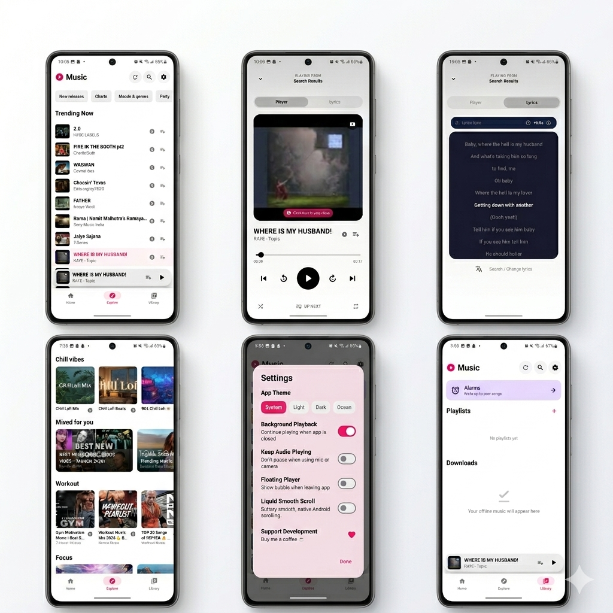
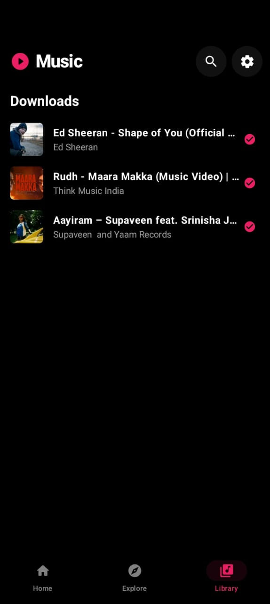
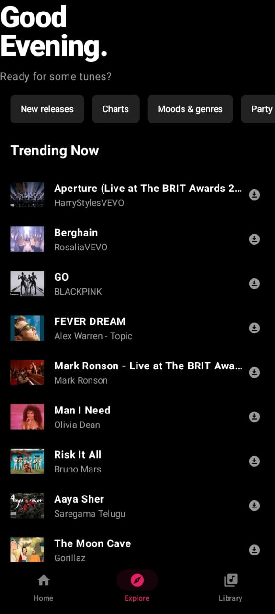
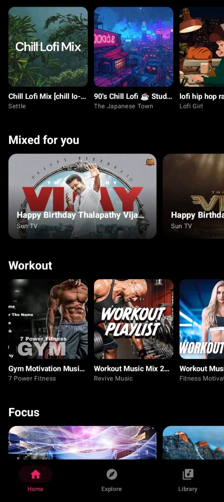

# 🎵 Vyllo - YouTube Music Client for Android

A clean, open source Android app for streaming YouTube Music with background playback, offline downloads, and a modern Material You interface.

<div align="center">

[]()
[](LICENSE)
[]()
[]()

</div>

---

## What is Vyllo?

Vyllo is a lightweight YouTube Music client built for Android. I made this because I wanted a simple music player that could stream from YouTube Music without ads, work in the background, and look good doing it. No accounts, no subscriptions—just pick a song and play.

## 📥 Download & Install

Grab the latest APK from the [Releases](https://github.com/Flames14/Vyllo/releases) page.

**Installation steps:**
1. Download the `app-release.apk` file
2. Enable "Install from Unknown Sources" if prompted
3. Tap the APK to install
4. Open Vyllo and start listening

*Requires Android 7.0 (API 24) or higher.*

## ✨ Features

Here's what Vyllo can do:

| Feature | What it does |
|---------|--------------|
| 🎧 **Background Playback** | Keep music playing with the screen off or while using other apps |
| 🎬 **Video Playback** | Watch music videos and visual content directly in the app |
| 📥 **Offline Downloads** | Save songs to your device for offline listening |
| 🎨 **Material You Design** | Colors that dynamically adapt to your album art |
| 📝 **Lyrics Integration** | Real-time synced lyrics from LRCLib |
| ⚡ **120Hz Support** | Smooth scrolling on high refresh rate displays |
| 🎵 **Audio Visualizer** | Real-time waveform visualization during playback |
| 🔵 **Floating Player** | Picture-in-picture style bubble player for quick controls |
| ⏰ **Alarm Feature** | Wake up to your favorite music |
| 🎲 **Smart Queue** | Shuffle, repeat, and manage your "Up Next" queue |

## 🛠️ How to Build from Source

Want to compile Vyllo yourself? Here's how:

### Prerequisites
- Android Studio Hedgehog (2023.1.1) or newer
- JDK 17
- Android SDK 34

### Steps

1. **Clone the repository**
   ```bash
   git clone https://github.com/Flames14/Vyllo.git
   cd Vyllo
   ```

2. **Open in Android Studio**
   - File → Open → Select the project folder
   - Let Gradle sync complete

3. **Build the APK**
   ```bash
   ./gradlew assembleRelease
   ```

   The APK will be at: `app/build/outputs/apk/release/app-release.apk`

   *Note: The build will use the default debug signing config. For personal use, this is fine.*

## 🖼️ Screenshots

<div align="center">
  
  
  
  
</div>

## 🏗️ Tech Stack

For anyone curious about what's under the hood:

- **Language**: Kotlin
- **UI**: Jetpack Compose + Material 3
- **Dependency Injection**: Hilt
- **Music Playback**: Android Media3 (ExoPlayer successor)
- **YouTube Extraction**: NewPipe Extractor
- **Networking**: OkHttp + DNS-over-HTTPS
- **Local Storage**: Room Database + DataStore
- **Image Loading**: Coil
- **Background Work**: WorkManager + Foreground Services

## 🤝 Contributing

Found a bug? Want to add a feature? Contributions are welcome!

- **Bug reports**: Open an issue with steps to reproduce
- **Feature requests**: Open an issue describing what you'd like to see
- **Pull requests**: Feel free to fork and submit PRs

For anything major, it's worth opening an issue first to discuss the approach.

## 📄 License

Vyllo is licensed under the **GNU General Public License v3.0** (GPL-3.0). See the [LICENSE](LICENSE) file for the full text.

## ⚠️ Disclaimer

This app is for personal use only. It does not host any content—all streams come directly from YouTube Music via the NewPipe Extractor library. Please respect YouTube's Terms of Service and copyright holders' rights.

---

**Built with ❤️ using Kotlin and Jetpack Compose**
