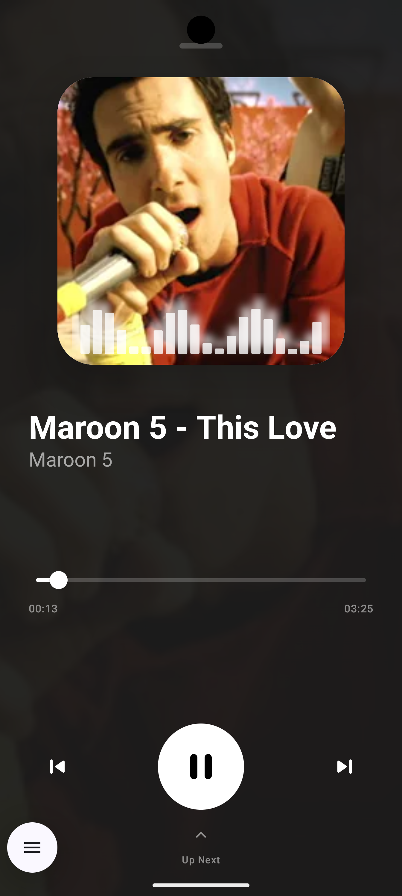
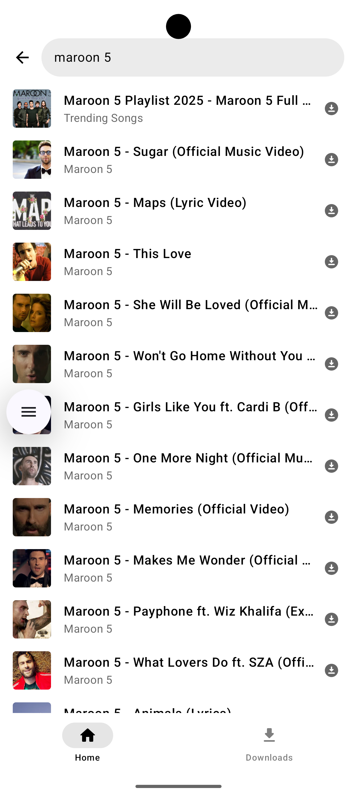

# MusicPiped - YouTube Music Streaming App

A modern, open-source YouTube Music streaming application built with Jetpack Compose and powered by NewPipe Extractor. Experience YouTube Music without ads, with enhanced features and a clean, intuitive interface.

## 🎵 Key Features

### Streaming & Playback
- **High-Quality Audio Streaming**: Streams audio directly from YouTube Music with optimized quality selection (Opus > M4A > MP3 prioritization)
- **Background Playback**: Listen to music while using other apps with full background playback support
- **Smart Buffering**: Advanced caching system with 60-second buffer for seamless playback
- **120Hz Smooth Scrolling**: Optimized UI performance for high refresh rate displays (under experiment)
- **Audio Visualizer**: Real-time audio visualization during playback

### User Experience
- **Modern UI/UX**: Beautiful Jetpack Compose interface with Material Design 3
- **Dynamic Theming**: Light, dark, and system theme support with smooth transitions
- **Responsive Design**: Optimized for all screen sizes and orientations
- **Smooth Animations**: Fluid animations and transitions throughout the app
- **Accessibility**: Full accessibility support for all users

### Content Discovery
- **Smart Recommendations**: Personalized content based on listening history and patterns
- **Mood-Based Playlists**: Curated playlists for different moods (Chill, Workout, Focus, etc.)
- **Real Search Suggestions**: Live suggestions as you type using YouTube's suggestion API
- **Related Songs**: Auto-generated playlists of similar tracks
- **Trending Content**: Stay updated with the latest trending music

### Offline Capabilities
- **Download Functionality**: Download songs for offline listening with progress tracking
- **Local Playback**: Seamlessly switch between online and offline content
- **Download Management**: View, manage, and delete downloaded content
- **Background Downloads**: Continue downloading while using other apps

### Advanced Features
- **Floating Player**: Bubble-style player that appears when leaving the app (optional)
- **Autoplay**: Automatic playback of similar tracks when current song ends
- **High Refresh Rate Support**: Optimized for 90Hz/120Hz displays
- **Audio-Only Optimization**: Efficient streaming that downloads only audio, not video
- **Memory Optimized**: Aggressive caching and memory management for smooth performance

## 📱 Supported Features

- ✅ YouTube Music search and streaming
- ✅ Background playback with notification controls
- ✅ Download songs for offline listening
- ✅ Floating player (bubble) support (on beta)
- ✅ Smart recommendations and related songs
- ✅ Mood-based content categories
- ✅ High refresh rate display optimization (on beta)
- ✅ Light/Dark/System theme modes (on beta)
- ✅ Audio visualizer during playback
- ✅ Comprehensive playback controls (play/pause/skip)
- ✅ Progress tracking and resume functionality
- ✅ Local file playback for downloaded content

## 🔧 Prerequisites

- Android 7.0 (API level 24) or higher
- Internet connection for streaming
- Storage space for downloaded content

## 🚀 Installation

### From GitHub Releases
1. Download the latest APK from the [Releases](https://github.com/Flames14/YMusic/releases) page
2. Install the APK on your Android device
3. Grant necessary permissions when prompted

### From F-Droid (Coming Soon)
The app will be available on F-Droid for easy installation and automatic updates.

## 🤝 Contributing

Contributions are welcome! Please feel free to submit a Pull Request. For major changes, open an issue first to discuss what you would like to change.

https://ko-fi.com/betadeveloper

## 📄 License

This project is licensed under the GNU General Public License v3.0 - see the [LICENSE](LICENSE) file for details.

## 🐛 Issues & Support

If you encounter any issues or have feature requests, please file them in the [Issues](https://github.com/Flames14/YMusic/issues) section.

## ⭐ Support the Project

If you find this app useful, consider starring the repository or contributing to its development!

---

**Note**: This app does not host any content. All content is streamed from YouTube Music through the NewPipe Extractor library. The app respects YouTube's terms of service and does not violate any copyright laws.